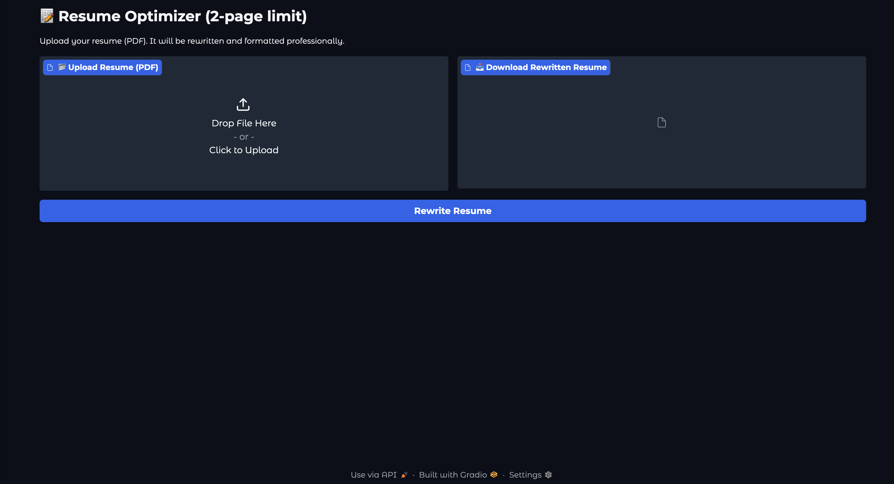

# 📝 AI-Powered Resume Optimizer

A web application that automatically rewrites and formats your resume into a professional, ATS-friendly, 2-page document.



## ✨ Key Features

-   **ATS-Friendly Formatting**: Generates a clean, single-column resume that applicant tracking systems can easily parse.
-   **Professional Rephrasing**: Uses a large language model to rewrite your resume with a professional tone, highlighting measurable achievements.
-   **2-Page Compliance**: Automatically condenses your resume to a maximum of two pages, a common industry standard.
-   **Simple Web Interface**: Easy-to-use interface for uploading your resume and downloading the optimized version.

## 🚀 Getting Started

Follow these instructions to set up and run the application on your local machine.

### Prerequisites

-   Python 3.7+
-   An Ollama-compatible LLM running locally (e.g., `gpt-oss:20b`)

### Installation

1.  **Navigate to the project directory.**

2.  **Create and activate a virtual environment:**
    ```bash
    # On macOS/Linux
    python3 -m venv myresume-env
    source myresume-env/bin/activate

    # On Windows
    python -m venv myresume-env
    myresume-env\Scripts\activate
    ```

3.  **Install the required dependencies:**
    ```bash
    pip install -r requirements.txt
    ```

### Running the Application

Once the dependencies are installed, start the Gradio web server:

```bash
python app.py
```

Open your web browser and navigate to the local URL provided in the terminal (usually `http://127.0.0.1:7860`).

## 🔧 How to Use

1.  **Upload Your Resume**: Click the "Upload Resume (PDF)" button and select your current resume in PDF format.
2.  **Rewrite**: Click the "Rewrite Resume" button to start the optimization process.
3.  **Download**: Once finished, a download link for the new `rewritten_resume.pdf` will appear.

## 📂 Project Structure

```
.
├── app.py              # Main Gradio application
├── resume_pipeline.py  # Core resume processing logic
├── llm_utils.py        # Utilities for LLM interaction
├── pdf_utils.py        # Utilities for parsing PDFs
├── report_utils.py     # Utilities for generating new PDFs
└── requirements.txt    # Project dependencies
```

## 🗺️ Roadmap

Future improvements and planned features:

-   [ ] Support for more input formats (e.g., `.docx`, `.txt`).
-   [ ] Allow users to choose from multiple resume templates.
-   [ ] Add a side-by-side comparison view of the original and rewritten resume.
-   [ ] Integrate with more LLM providers.

## 🤝 Contributing

Contributions are welcome! If you have ideas for improvements or want to fix a bug, please open an issue or submit a pull request.

1.  Fork the Project
2.  Create your Feature Branch (`git checkout -b feature/AmazingFeature`)
3.  Commit your Changes (`git commit -m 'Add some AmazingFeature'`)
4.  Push to the Branch (`git push origin feature/AmazingFeature`)
5.  Open a Pull Request

## 📄 License

This project is licensed under the MIT License.
